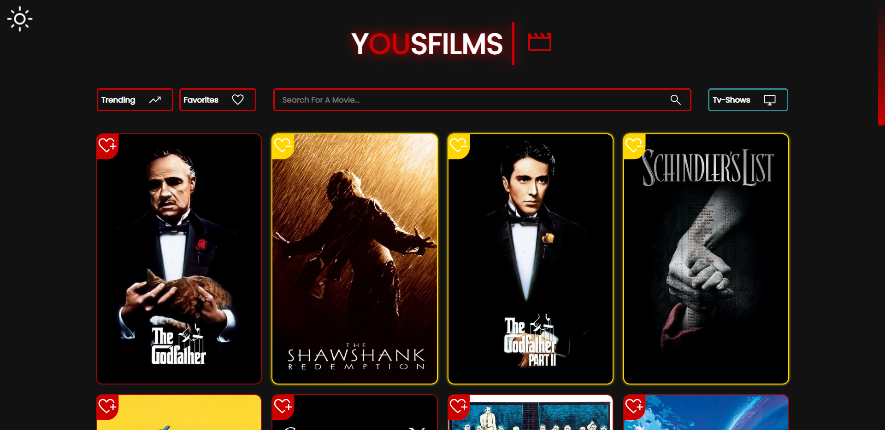
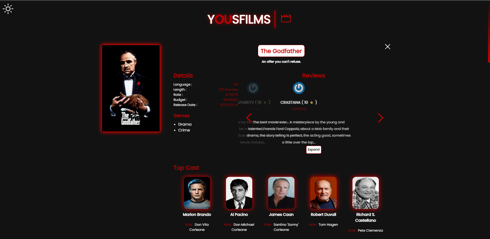
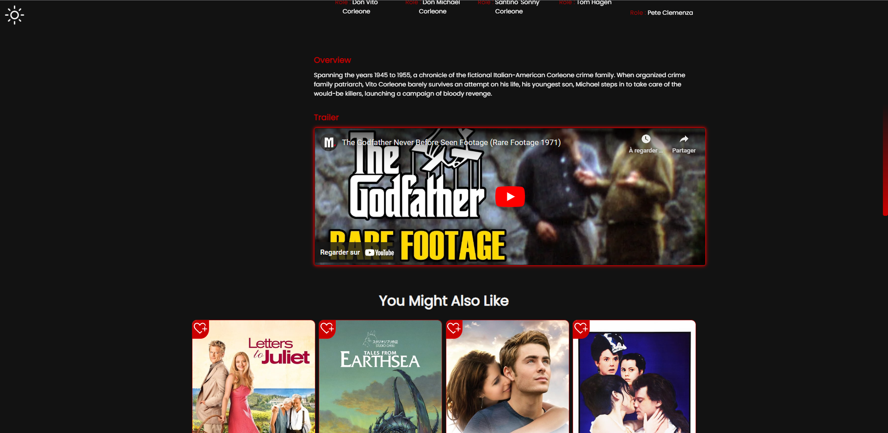
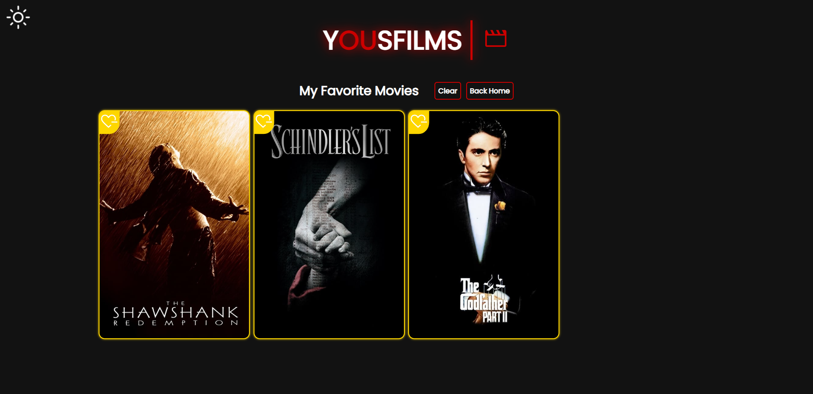
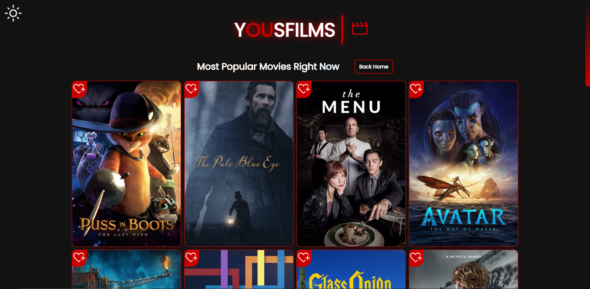
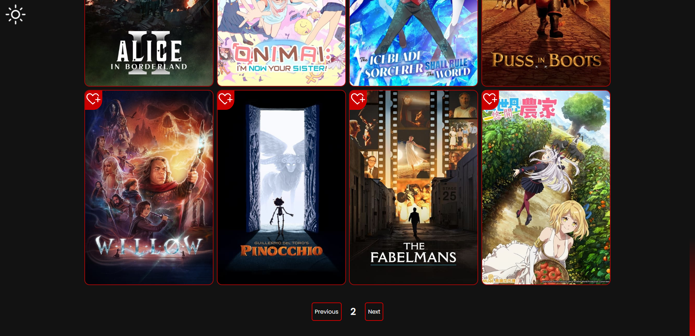

## Welcome To YOUSFILMS :

This is a high performant & fully responsive React Application, that you can check now on [yousfilms.app](https://yousfilms.netlify.app/) <=

## Overview :

## Features :

- You can search for a movie by it's name, get the single movie details
  (cast, trailer, reviews slider, recommendations that are related to the
  specific movie type ) by clicking the movie card.
- The tv-Shows button in the Search Bar opens another website with
  the same logic but for Tv Shows.
- Pagination is available at the bottom of each page.
- You can toggle between dark and light themes.
- Originally I managed state with UseState hook, nevertheless later in
  the project I extracted the state logic into a reducer which makes
  state management a lot simpler.
- Once I ended developing the main functionalities of the site, I
  implemented React Lazy/Suspense for code splitting and followed Lighthouse recommendation to aim for an extremely improved
  performance scores. The average Lighthouse analyze tool scores now
  are : Performance : 97 // Accessibility : 100 // Best Practices : 92 //
  SEO : 100
